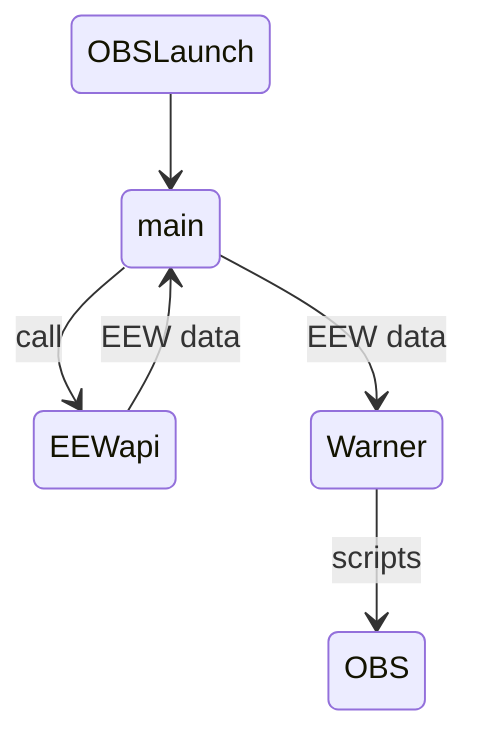

# EEW-for-Stream
To provide EEW(Earthquake Early Warning) for streaming via OBS

## System Design
It call EEW api and if it receive warning signals it provide OBS popup changing screen or do scripts.

## Notes
### EEW API
- https://www.p2pquake.net/develop/json_api_v2/#/
